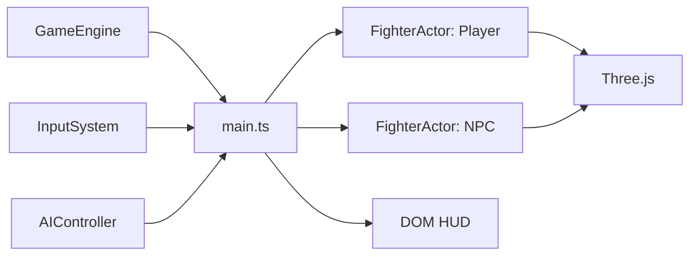
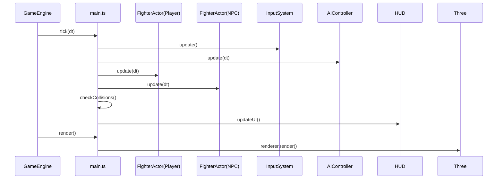

# XState + Three.js Fighting Template

A minimal, deterministic(ish) in-browser fighting-game template:

- **Brain**: [XState](https://xstate.js.org/) for character logic (idle/walk/attack/hurt/KO).
- **Body**: [Three.js](https://threejs.org/) for visuals.
- **Nerves**: Input buffering + action mapping (keyboard today; gamepad later).
- **HUD**: Plain HTML/CSS overlay (health bars + K.O. screen).

This repo intentionally keeps things small, readable, and hackable.

## Run locally

Prereqs:

- Node.js 18+ (recommended: latest LTS)

Install + run:

```bash
npm install
npm run dev
```

Build + preview:

```bash
npm run build
npm run preview
```

## Controls

Default mapping lives in `src/input/InputSystem.ts`.

- Move: Arrow keys
- Light punch: `Z`
- Heavy punch: `X`
- Block: `C`
- Ultimate: `Space`

Combos are detected via the input buffer; currently registered in `src/main.ts`:

- `JOINT_LOCK`: `Down` → `Right` → `Heavy Punch`

## Project structure

```text
src/
  main.ts                    # Composition root (wires engine, systems, HUD)
  core/
    GameEngine.ts            # Fixed-timestep loop + event dispatching
  data/
    fighters.json            # Character definitions (maxHp, etc.)
  input/
    InputSystem.ts           # Action mapping + input buffer + combo detection
  logic/
    fighterMachine.ts        # XState fighter machine (HP, KO)
    FighterActor.ts          # Wraps mesh + XState actor
    AIController.ts          # Simple NPC brain
  db/
    schema.ts                # Drizzle (placeholder; not wired into runtime yet)
```

## Architecture

### Core loop

- **`GameEngine`** (`src/core/GameEngine.ts`) manages the loop using `requestAnimationFrame`.
- It maintains a fixed timestep (`1/60`) accumulator for logic updates (`tick`).
- It triggers a render callback once per frame.
- `main.ts` wires these callbacks to the actual game logic and renderer.

Key files:

- `src/core/GameEngine.ts`: reusable loop logic.
- `src/main.ts`: wires systems together.
- `src/logic/FighterActor.ts`: "entity" wrapper; keeps composition clean.
- `src/logic/fighterMachine.ts`: game rules + HP + KO.

### Health + KO

- `fighters.json` defines `maxHp` per character.
- `fighterMachine.ts` initializes `context.hp/maxHp` from input.
- On `HIT_RECEIVED`, fighter enters `hurt`, applies damage, then transitions to `ko` (final) if `hp <= 0`.

### HUD

`index.html` contains a fixed-position HUD overlay:

- Two health bars bound to `#p1-hp` and `#p2-hp`
- KO banner bound to `#ko-screen`

`src/main.ts` reads XState snapshots and updates DOM widths as percentages in the tick loop.

## Mermaid diagrams

### Systems overview



### Fixed-timestep update sequence


