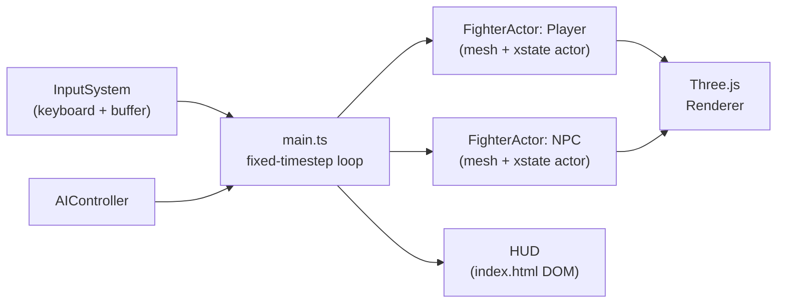
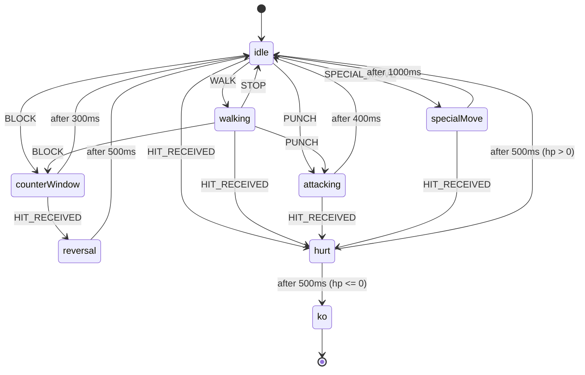
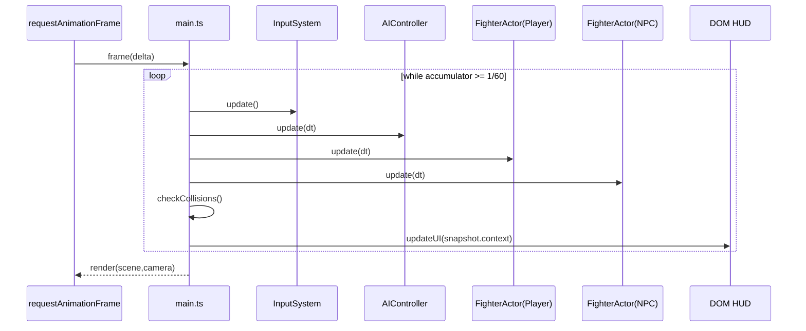

# XState + Three.js Fighting Template

A minimal, deterministic(ish) in-browser fighting-game template:

- **Brain**: [XState](https://xstate.js.org/) for character logic (idle/walk/attack/hurt/KO).
- **Body**: [Three.js](https://threejs.org/) for visuals.
- **Nerves**: Input buffering + action mapping (keyboard today; gamepad later).
- **HUD**: Plain HTML/CSS overlay (health bars + K.O. screen).

This repo intentionally keeps things small, readable, and hackable.

## Run locally

Prereqs:

- Node.js 18+ (recommended: latest LTS)

Install + run:

```bash
npm install
npm run dev
```

Build + preview:

```bash
npm run build
npm run preview
```

## Controls

Default mapping lives in `src/input/InputSystem.ts`.

- Move: Arrow keys
- Light punch: `Z`
- Heavy punch: `X`
- Block: `C`
- Ultimate: `Space`

Combos are detected via the input buffer; currently registered in `src/main.ts`:

- `JOINT_LOCK`: `Down` → `Right` → `Heavy Punch`

## Project structure

```text
src/
  main.ts                    # Game loop + orchestration + HUD sync
  data/
    fighters.json            # Character definitions (maxHp, etc.)
  input/
    InputSystem.ts           # Action mapping + input buffer + combo detection
  logic/
    fighterMachine.ts        # XState fighter machine (HP, KO)
    FighterActor.ts          # Wraps mesh + XState actor
    AIController.ts          # Simple NPC brain
  db/
    schema.ts                # Drizzle (placeholder; not wired into runtime yet)
```

## Architecture

### Core loop

- The renderer runs every animation frame.
- The simulation runs at a fixed timestep (`1/60`) using an accumulator.
- `main.ts` orchestrates input, AI, actors, collision rules, and UI sync.

Key files:

- `src/main.ts`: single place where systems are composed.
- `src/logic/FighterActor.ts`: "entity" wrapper; keeps main loop clean.
- `src/logic/fighterMachine.ts`: game rules + HP + KO.

### Health + KO

- `fighters.json` defines `maxHp` per character.
- `fighterMachine.ts` initializes `context.hp/maxHp` from input.
- On `HIT_RECEIVED`, fighter enters `hurt`, applies damage, then transitions to `ko` (final) if `hp <= 0`.

### HUD

`index.html` contains a fixed-position HUD overlay:

- Two health bars bound to `#p1-hp` and `#p2-hp`
- KO banner bound to `#ko-screen`

`src/main.ts` reads XState snapshots and updates DOM widths as percentages.

## Mermaid diagrams

### Systems overview



### Fighter state machine



### Fixed-timestep update sequence



## Notes / next upgrades

- **Debounce hits properly**: add per-attack hit IDs or active-frames to prevent edge-case multi-hit.
- **Move data**: drive damage/range/active frames from `fighters.json` (or a move manifest).
- **Rollback netcode**: possible once logic is fully deterministic and input-driven.
- **Persistence**: wire Drizzle/SQLite or IndexedDB to store keybinds, stats, match history.
