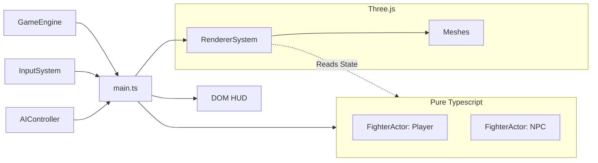
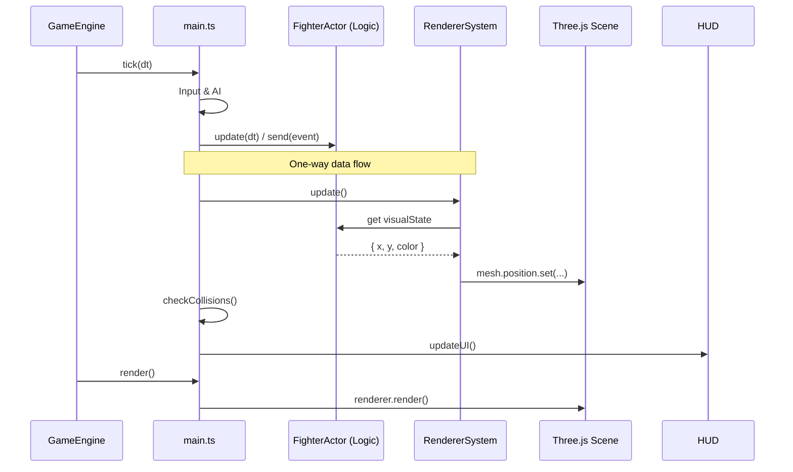

# XState + Three.js Fighting Template

A minimal, deterministic(ish) in-browser fighting-game template:

- **Brain**: [XState](https://xstate.js.org/) for character logic (idle/walk/attack/hurt/KO).
- **Body**: [Three.js](https://threejs.org/) for visuals (decoupled from logic).
- **Nerves**: Input buffering + action mapping (keyboard today; gamepad later).
- **HUD**: Plain HTML/CSS overlay (health bars + K.O. screen).

This repo intentionally keeps things small, readable, and hackable.

## Run locally

Prereqs:

- Node.js 18+ (recommended: latest LTS)

Install + run:

```bash
npm install
npm run dev
```

Build + preview:

```bash
npm run build
npm run preview
```

## Controls

Default mapping lives in `src/input/InputSystem.ts`.

- Move: Arrow keys
- Light punch: `Z`
- Heavy punch: `X`
- Block: `C`
- Ultimate: `Space`

Combos are detected via the input buffer; currently registered in `src/main.ts`:

- `JOINT_LOCK`: `Down` → `Right` → `Heavy Punch`

## Project structure

```text
src/
  main.ts                    # Composition root (wires engine, systems, renderer, HUD)
  core/
    GameEngine.ts            # Fixed-timestep loop + tick/render callbacks
  data/
    fighters.json            # Character definitions (maxHp, etc.)
  input/
    InputSystem.ts           # Input buffering & combo detection (Typed Intent)
  logic/
    fighterMachine.ts        # XState fighter machine (Pure Logic)
    FighterActor.ts          # Logic wrapper (Position/State, NO THREE.JS)
    AIController.ts          # Simple NPC brain
    types.ts                 # Shared types (FighterEvent, Intent, Context)
  db/
    schema.ts                # Drizzle schema (Future persistence)
```

## Architecture

### 1. Decoupled Visuals (New)

Logic and rendering are completely separated.

- **`FighterActor`** (Logic) is pure TypeScript. It has no idea `Three.js` exists. It runs the XState machine and updates coordinates.
- **`RendererSystem`** (Visuals) lives in `main.ts`. It polls the actor's `visualState` (position, color code) and updates the meshes.

This means you can run the game logic in a headless test environment (Node.js) without WebGL crashes.

### 2. Type Islands

We use "Pragmatic TypeScript" to balance safety and velocity:

- **Strict Boundaries**: Inputs, Events, and State Context are strongly typed.
- **Loose Internals**: We allow some flexibility inside implementation details to prevent type gymnastics.
- **Adapters**: `FighterActor.send()` acts as a typed gateway, preventing `any` casts from leaking into the game loop.

### Core loop

- **`GameEngine`** (`src/core/GameEngine.ts`) owns the fixed-timestep accumulator.
- `main.ts` wires the pieces:
  1. **Tick (Logic)**: Input -> AI -> Actors -> Collisions
  2. **Update Visuals**: Logic State -> Three.js Meshes
  3. **Render**: Scene -> Canvas

## Mermaid diagrams

### Systems overview



### Fixed-timestep update sequence



## Notes / next upgrades

- **Debounce hits properly**: add per-attack hit IDs or active-frames to prevent edge-case multi-hit.
- **Move data**: drive damage/range/active frames from `fighters.json` (or a move manifest).
- **Rollback netcode**: possible now that logic is fully deterministic and decoupled from visuals.
- **Persistence**: wire Drizzle with `sqlite-wasm` or `localStorage` (removed incompatible `better-sqlite3`).
